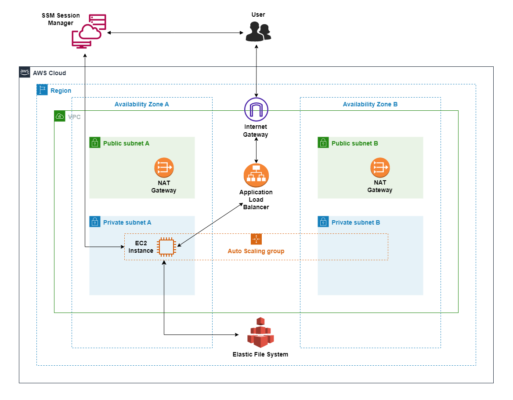

# Jenkins on AWS

## Background
Jenkins is a popular, open source, Java-based CI/CD tool that integrates with the major cloud providers (AWS, Azure, GCP and DigitalOcean) and has a rich set of plugins.
However, in my opinion, when it comes to Jenkins, there is a learning curve. You really need to have a good play with Jenkins in order to get
comfortable with it (at least this was my experience).  
Therefore, in this repo, you will find an AWS CloudFormation template I created, that deploys an highly available Jenkins server (one node).  
Please feel free to use this CloudFormation template if you want to practice working with Jenkins.  

***WARNING: deploying the template will incur costs.***

## Architecture

## Deploying the CloudFormation template
The easiest way to deploy the CloudFormation template is via the AWS Management Console.  
Steps:
1. Clone/download this repo.
2. Log into the AWS Management Console.
3. Choose a region you want the infrastructure to be deployed to.
4. Go to the CloudFormation console.
5. Click on `Create stack`.
6. For the section ***Prerequisite - Prepare template***, ensure ***Template is ready*** is selected.
7. For the section ***Specify template***, click on `Upload a template file`.
8. Click on `Choose file` and select ***jenkins.yml***.
9. Click `Next`.
10. Enter a name for the CloudFormation stack.
11. Fill in values for the parameters.
12. Click `Next`.
13. Scroll down and click `Next`.
14. Review the details on the page.
15. At the bottom of the page click on the box to acknowledge that AWS CloudFormation might create IAM resources with custom names.
16. Click `Submit`.
17. Wait for the stack to complete (will take some time - please be patient).

## Issues/improvements
If you come across any issues, or have suggestions for improvements, please create an issue/pull request and I will review it as soon as possible. 
## 
